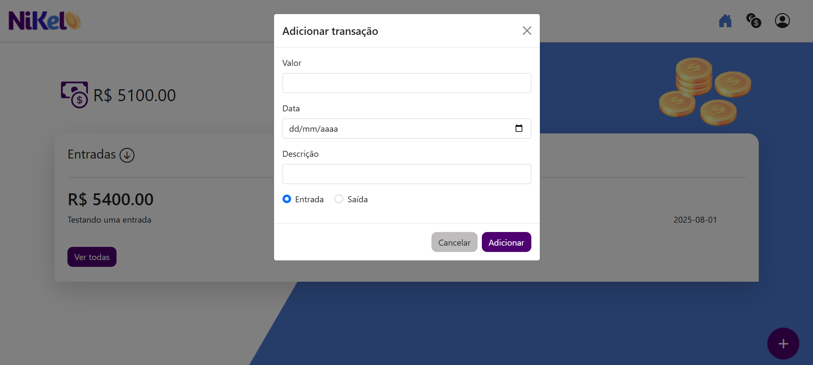

# 💰 Nikel

Um projeto simples de controle de finanças pessoais desenvolvido com **HTML**, **CSS**, **JavaScript puro** e **Bootstrap**. A aplicação permite o gerenciamento de entradas e saídas financeiras de forma prática, armazenando os dados no navegador com `localStorage`.

## 📸 Demonstração




---

## 🚀 Funcionalidades

- ✅ Cadastro de transações (entrada e saída)
- ✅ Listagem de transações em uma tabela
- ✅ Cálculo automático de saldo total
- ✅ Tooltip no botão flutuante para adicionar transações
- ✅ Armazenamento local usando `localStorage`
- ✅ Validação de dados no formulário
- ✅ Design responsivo com Bootstrap 5

---

## 🧠 Tecnologias Utilizadas

- HTML5
- CSS3
- JavaScript
- Bootstrap 5
- LocalStorage API

---

## 📂 Estrutura do Projeto

```bash
📁 nikel/
├── index.html # Tela de login
├── home.html # Tela inicial com saldo
├── transactions.html # Tela de controle de transações
├── css/ # Estilos CSS
│ └── style.css
├── js/ # Scripts JavaScript
│ ├── index.js
│ ├── home.js
│ └── transactions.js
└── assets/ # Imagens e ícones
```

---

## 🧪 Como Usar

1. Clone o repositório:

```bash
git clone https://github.com/seu-usuario/nikel.git
```
cd nikel

2. Abra o arquivo index.html no navegador (ou com Live Server no VS Code).

3. Crie o login:
Basta cadastrar um nome de usuário e senha para simular o login.

4. Acesse as telas:

Home: mostra o saldo total e permite adicionar entradas/saídas
Transações: permite visualizar todas as transações


### 📝 Melhorias Futuras

🔒 Implementar autenticação real
☁️ Salvar dados em um backend real (ex: Firebase ou Express)
🗑️ Permitir excluir transações
✏️ Permitir editar transações


### 👩‍💻 Desenvolvedora
Feito por Elane

[LinkedIn](https://www.linkedin.com/in/elanealencar/)